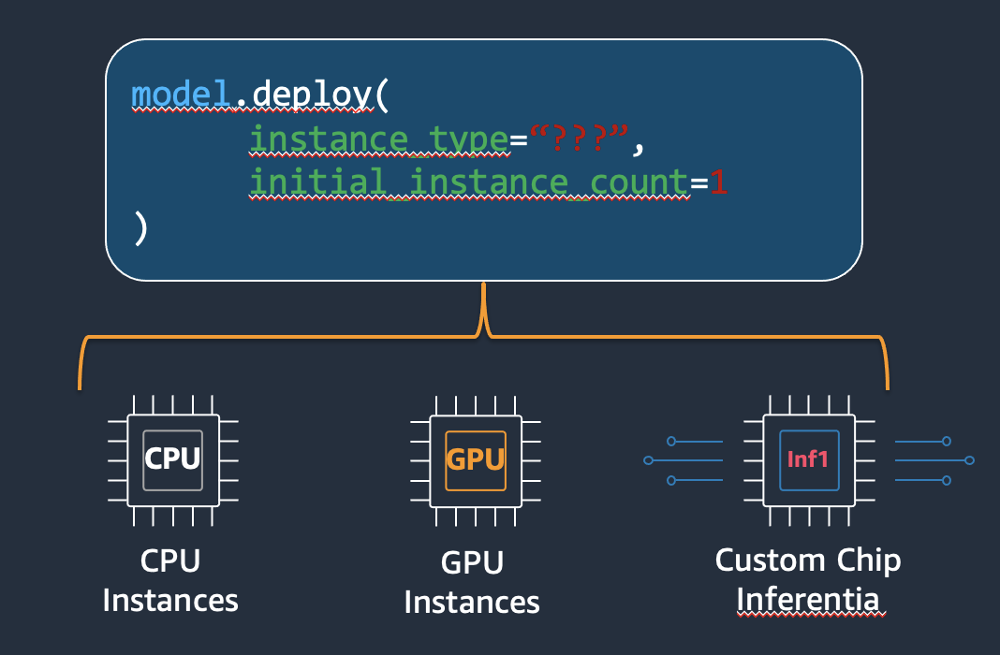
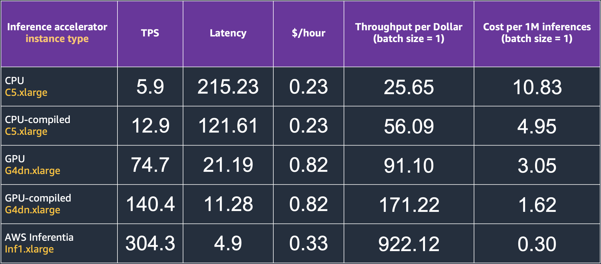
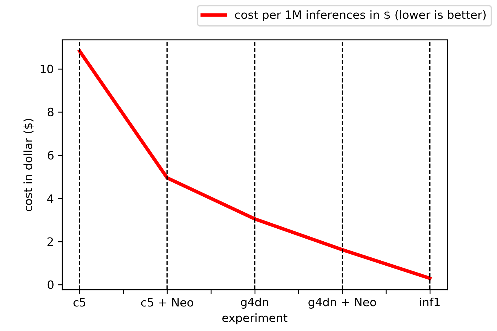
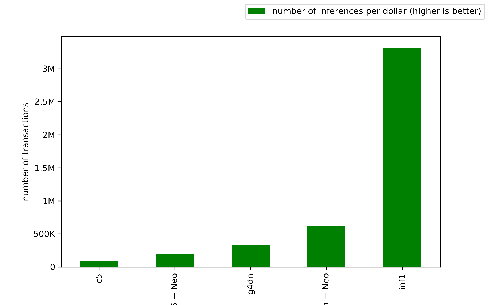

# Benchmark of AWS accelerators for pre-trained ResNet-50 with SageMaker and PyTorch

In this notebook we will see how to deploy a pretrained model from the PyTorch Vision library, in particular a ResNet50, to Amazon SageMaker. We will also test how it performs on different hardware configurations, and the effects of model compilation with Amazon SageMaker Neo. In a nutshell, we will test:

- ResNet50 on a ml.c5.xlarge, uncompiled
- ResNet50 on a ml.g4dn.xlarge, uncompiled
- ResNet50 on a ml.c5.xlarge, compiled
- ResNet50 on a ml.g4dn.xlarge, compiled
- ResNet50 on a ml.inf1.xlarge, compiled

## Results

In order to measure throughput and latency, we have written a test script which is available in the repository in the [load_test.py](load_test.py) file. The load test module creates multiple concurrent client invocations with python multi-threading and measures the throughput per second and end to end latency. In our tests, we’ve chosen a `ml.c5.4xlarge` as our client test instance and configured the test script to use 16 concurrent threads (`num_threads=16`), since the instance comes with 16 vCPUs. You can check the specs of instances on the [SageMaker Pricing page](https://aws.amazon.com/it/sagemaker/pricing/). Furthermore, our tests only use one image per inference. Batching of multiple images per inference would bring different results for all of the below instances. The results have been reported in the following table:

The below plots summarize the results obtained in our tests: Inferentia machines are the most cost-effective instances for CV inference workloads, with a 0.3$ per 1M inferences with respect to the 1.62$ of the compiled model on the `g4dn.xlarge` instance and the 4.95$ of the compiled model on the `ml.c5.xlarge` instance, making `inf1.xlarge` instances respectively 5.4x and 16.5x more cost-effective. 

Taking into account the sheer number of transactions per hour, Inferentia instances also show the best performances, achieving 1.1M transactions per hour, with respect to 0.5M transactions per hour of the GPU-compiled model and the 40K transactions per hour of the CPU-compiled model.

## Security

See [CONTRIBUTING](CONTRIBUTING.md#security-issue-notifications) for more information.

## License

This library is licensed under the MIT-0 License. See the LICENSE file.